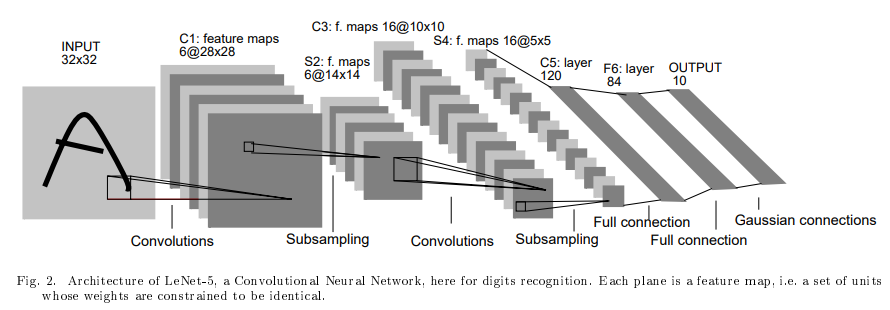

<h1>🎈LeNet-5 By Pytorch</h1>
 
<h3>Model Architecture</h3>

<h3>설명</h3>
- model.py : LeNet pytorch   
- train.py : Using LeNet to train MNIST DATA  
- Using DATA : <a href="https://en.wikipedia.org/wiki/MNIST_database">MNIST</a>
 

<b>Blog link : <a href = "https://eumgill98.tistory.com/22">https://eumgill98.tistory.com/22</a>
 
<b>Paper link : <a href="http://vision.stanford.edu/cs598_spring07/papers/Lecun98.pdf">http://vision.stanford.edu/cs598_spring07/papers/Lecun98.pdf</a>

